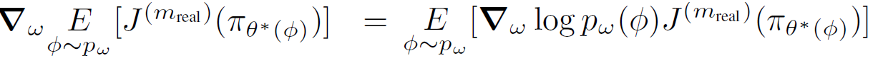
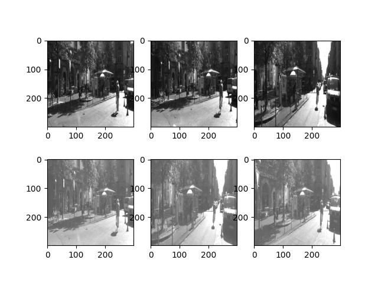
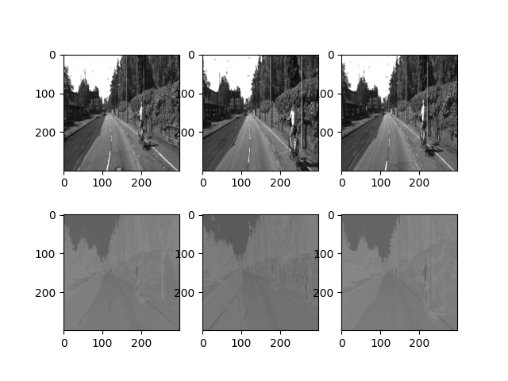
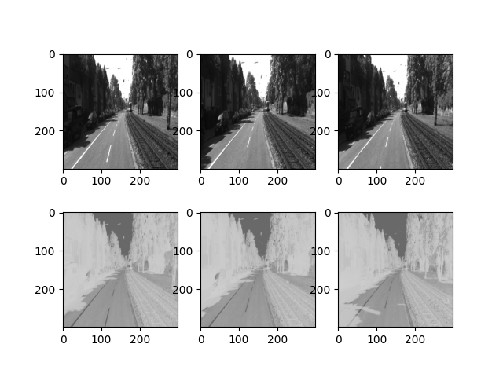
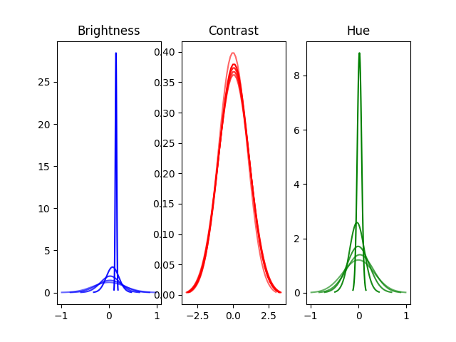
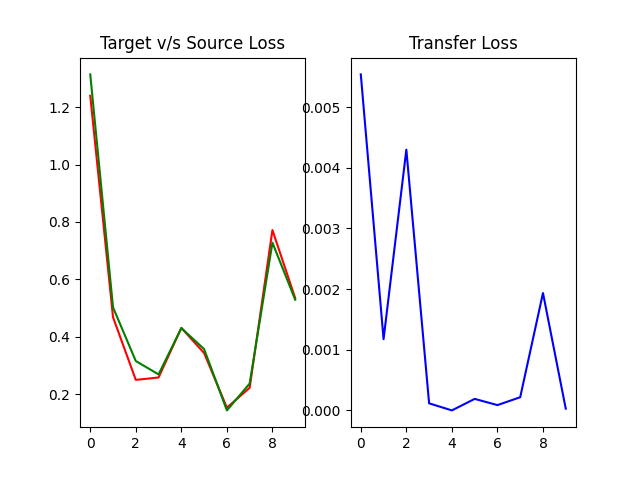

# Guided Domain Randomization

This project acts as a first step to understanding **[domain randomization](https://lilianweng.github.io/posts/2019-05-05-domain-randomization/)** in the context of **sim2real** transfer learning. The idea is to work on a dummy dataset that provides images + odometry data to train a CNN with regressive capabilities and learn a mapping from *image* &#8594; (*steering angle*, *acceleration*).

> ### Disclaimer
> The key reason for not working with jupyter notebooks and not being able to train on larger batches was to accomodate hardware limitations. This is meant solely as an experiment to understand domain randomization and not intended to be used without necessary adjustments.

## Data Collection
Data has been used from [KITTI](http://www.cvlibs.net/datasets/kitti/raw_data.php). It provides an image dataset with odometry data and point clouds. 
Steps to download and preprocess data are as follows:
1. Visit KITTI
2. Create an account as prompted after clicking on *raw dataset development script*
3. Download the zip file, unzip it and run the downloader script
4. Run `data_import.py` after creating a `./data/real` directory, or making necessary changes to the file based on your directory structure

These steps will create an `image.tfrecords` file in `./data/real`.

## CNN
This project makes use of a pretrained **[Inception_ResNet_V2](https://tfhub.dev/google/imagenet/inception_resnet_v2/feature_vector/5)** feature vector model to offload some of the modeling since that isn't the primary concern at this phase. Extra *dense layers* have been added to the output of the base ResNet to transform the identified features into the required 2-dimensional output that essentially boils down to predicting the steering angle and acceleration of the vehicle based on the image input. **Dropout** and **Regularization** has been added, although during test runs the number of epochs are so low that dropout has no real advantage in this scenario.
The model is located at `model.py`.

## Domain Randomization
Inspiration for this implementation comes from 3 papers:
1. [Quan Vuong et. al.](https://arxiv.org/abs/1903.11774v1)
2. [Josh Tobin et. al.](https://arxiv.org/abs/1703.06907)
3. [Open AI Shadow Hand](https://arxiv.org/abs/1808.00177)

In this implementation, DR works as follows:
- Initialize *Normal* distributions for each configuration parameter with means and variances within acceptable ranges
- Initialize and compile the *ResNet* model
- Repeat 
  - Sample config params from their distributions
  - Apply necessary transforms to training and testing data
  - Train the model on transformed data
  - Evaluate the model on transformed and original data
  - Compute transfer loss as the squared loss between source domain and target domain
  - Compute gradients of distribution params wrt transfer loss
  - Update distribution params with SGD optimizer

The computation for loss over the distribution params is taken directly from 1 in the paper list. It is as follows:

## Gallery of Randomizations
The top row shows the target domain or, the real image in its unaltered form. The bottom row shows the source domain or, the transformed image after applying random perturbations.
 

More images can be found in the `./gallery` directory.

## Results
The change of distributions over time has been shown below. Lighter colors denote earlier epochs, and darker colors indicate later epochs. 

The transfer loss, source loss and target loss have been shown below. The **red** line shows source loss, the **green** shows target loss, and the other plot shows the transfer loss.
 

## Future Concerns
- Parallelizing workload to update gradients based on multiple samples
- Identifying what configuration parameters can be operated on and how they can transform the data
- Considering RL and PPO for training the agent
- Considering Genetic Algorithms for guided DR

---
Baladitya Swaika, *March 2022*.